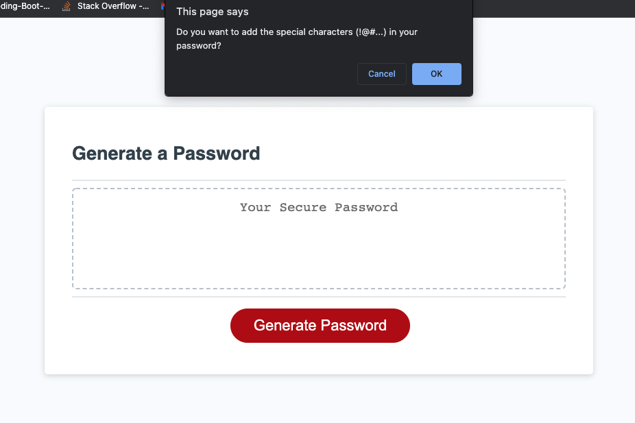

# Secure Password Generator

## About me
I am GW coding bootcamp student, looking to solve problems, I have a passion for learning  and sharing my knowlege with other as publicaly as possible, if you found value in something I have created, please feel free to give me a shout out @Tariq_Stanikizai, fell free to reach out in case you want to just get in touch also.

## Purpose:
This command block creates unique and secure passwords with upper-lower case characters, numbers and special Characters.

## Features:
Gives the option to generate either a 8 or 128 character password with the following rules:

* First letter is always a letter
* Includes lowercase letters
* Includes uppercase letters
* Includes numbers
* Includes special characters

## Buld with:
* HTML
* CSS
* JAVA SCRIPT

The following image demonstrates the application functionality:

## Usage:
This should only be used as an exploration or educational project.

## Links:

* The URL of the deployed application.
https://tariqstanikzai.github.io/SPG-Secure-Password-Generator/
* The URL of the GitHub repository.
 https://github.com/Tariqstanikzai/SPG-Secure-Password-Generator

## Contact
 * @tariq_stanikzai

